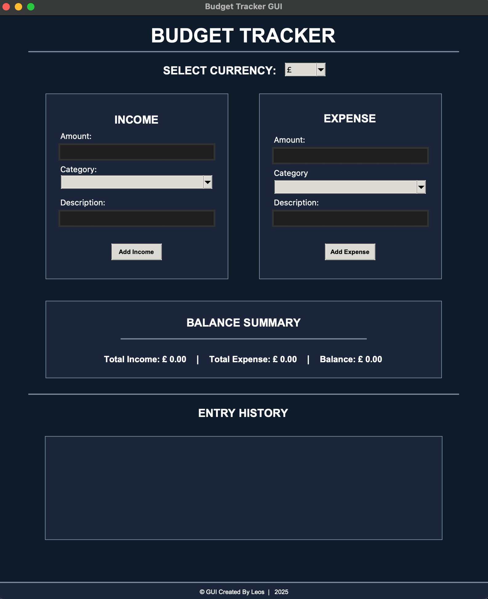
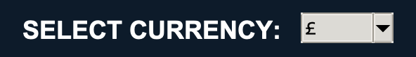
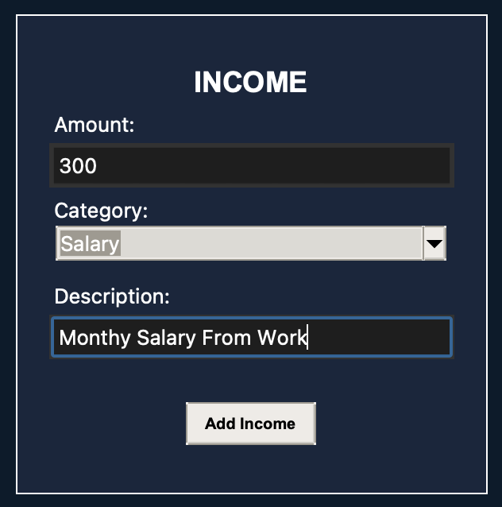
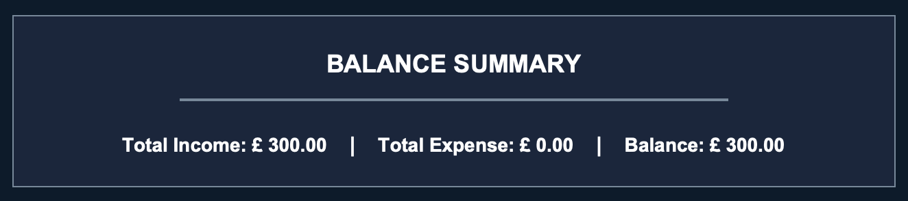
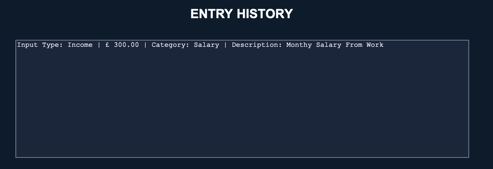
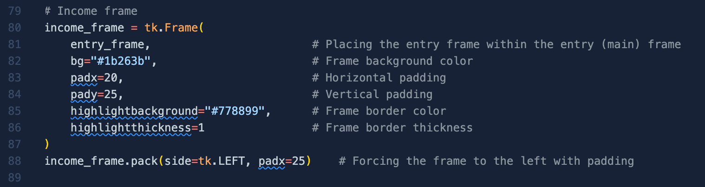
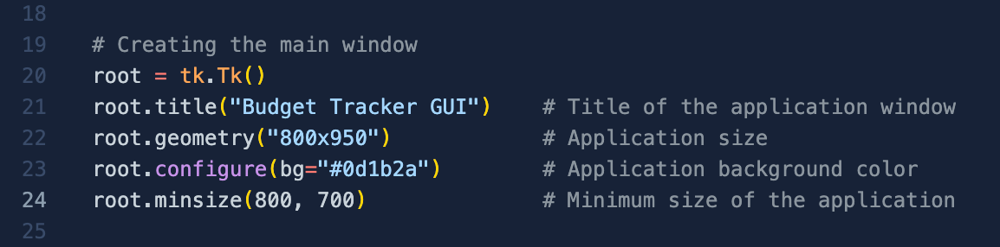

  <h1>
    
  </h1>

## Project Overview
This project is a **Budget Planner** GUI (Graphical User Interface) made with tkinter (python) for users to manage finances through entering their income and expenses with categories and see a summary of your balance and status displayed in a clear and aesthetic design. You may also see your entry history to check for any errors you may have inputted!

This project calculates a users total income, total expenses and remaining balance with a clear and well-thought design to display to users through Tkinter.

## Setup And Installation

**1 - Ensure Python 3 Is Installed Found Here:**  
[Python Download Link](https://www.python.org/downloads/)

**2 - Ensure Git Is Installed On Your System Found Here:**  
[Git Download Link](https://git-scm.com/downloads)

**3 - Clone The GitHub Repository:**  
Head To Your Terminal And Enter:  
1 - cd.desktop  
2 - git clone https://github.com/Leoelo4/Budget-Planner.git  
Alternatively Follow These Youtube Tutorials For **[Windows](https://www.youtube.com/watch?v=EhxPBMQFCaI)** & **[Mac](https://www.youtube.com/watch?v=R9Efdq3Fj-A)**

**4 - Hit Play / Run Python File**

## Project UI / Application Overview
**Project UI Screenshot (Mac)**

## How To Use This Project?
**1 - Select Currency** From The Dropdown Menu At The Top (Default: GBP (£))

  

**2 - Enter Desired Income/Expense** & **Select A Category**. Optionally You May Write A **Description** And Then Click **Add Income**.

  

**3 -** Now Your Input Is Confirmed, **View Your Summary** Showing you **total income**, **expenses** and **current balance**!

  

**4 - View Your Entry History**, clearly showing the input type, amount, category and description entered from your input for ease to view all previous inputs!

## Possible Edits

*Although* the source code is currently specific and would require some work in order to edit by you, It is clearly described in the inline comments which line does what, it is possible to edit the code to your liking.

Section where **Background Colour (BG) or Font Colour (FG)** can be edited to suit your preferences, although currently this requires large amounts of lines changed, future coding improvements may allow for singular line change needed for all colours of a section.

Here, the frame background colour (bg) can be seen and changed with the border (highlightbackground) hexcode can be edited too.

Current **Window Size** is set to 800x950 for all content to be seen. However is at minimal 800x700, this will hide the history section but still allow full use of the product and can be changed in the code. The current product does not include a scrolling feature however future improvements may include.

 

  <h1>
    
  </h1>

 

