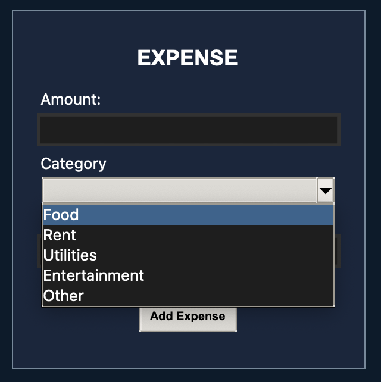
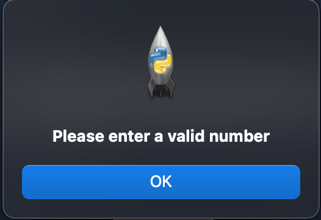
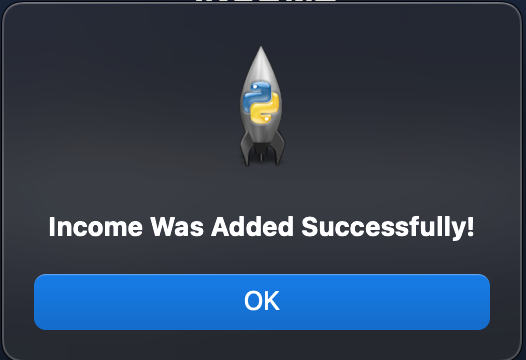
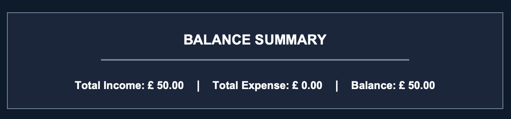
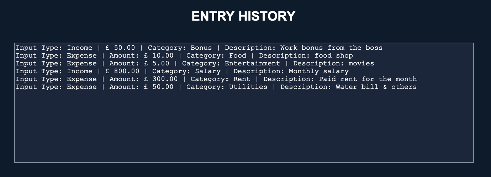

  <h1>
    
  </h1>

## Overview
**Manual Testing** has been done through the program to further show the functionality. As well as this, a limitations of python's 'unittest' framework is not allowing for testing of buttons and other functionality. Therefore manual GUI actions were tested, with images being shown below.

## General Functionality
**-** GUI Opens without any errors  
**-** Window is able to be resized as expected & Minimum window size works as expected  
**-** No crashes or freezes during general use  

## Notes
**-** All tests were performed on Mac  
**-** Each feature is shown with a screenshot testing example  
**-** No bugs were found at the time of publishing however possible future improvements may see easier customisation by users

## Dropdown Menu's
**- Currency Selection Dropdown** shows all expected options (£, $ & €)

**- Income Category Dropdown** displays expected options (Salary, Bonus & Other)

**-Expense Category Dropdown** displays all expected options (Food, Rent, Utilities, Entertainment & Other)

**Screenshot Example**

## Inputs & Buttons

**- Add Income Button** adds a valid income entry and updates the summary and history sections

**- Add Expense Button** adds a valid expense entry and updates the summary and history sections

**-** A Category **MUST** be selected in order to add an entry

**- Invalid input** such as empty, negative or non-numerical inputs will display an error to users

**- Valid Input** displays a message box to users to confirm a correct input was recognised & recorded.

## Summary Section
**- Summary** updates after a valid input and displays total income, expenses and balance to you

**Screenshot Example**

**- History Section** displays all previous inputs created by you in correct order and in correct format

**Screenshot Example**

  <h1>
    
  </h1>

 
